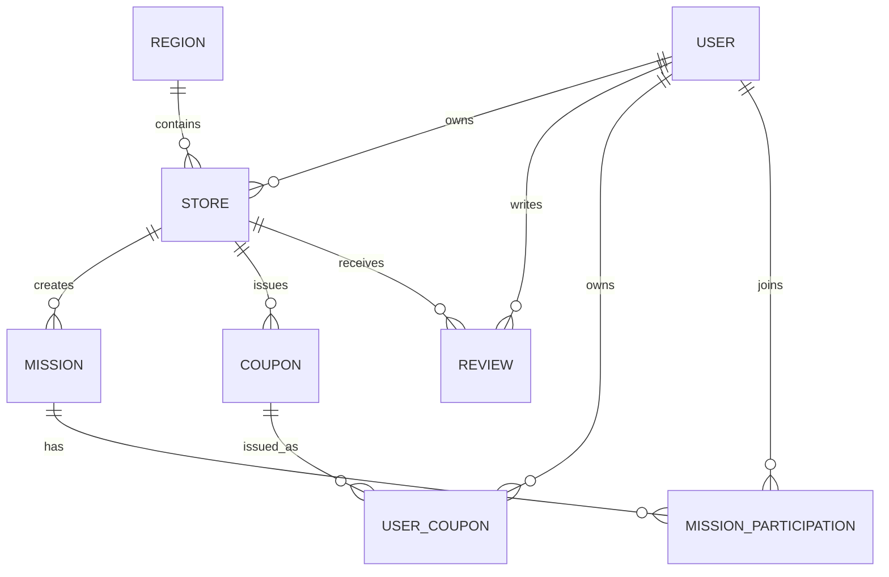

# 26. ERD - Database Relationship

## 목적
남포 GoGo의 핵심 데이터 구조와 관계를 한눈에 보기 위한 ERD 문서입니다.

## 핵심 엔티티
- REGION
- USER
- STORE
- MISSION
- COUPON
- USER_COUPON
- REVIEW
- MISSION_PARTICIPATION

## 설계 원칙
- 파일은 Storage에 저장하고 DB에는 URL만 저장
- Audit Log는 수정 불가
- GPS 로그는 30일 후 삭제
- Region 기반 확장 지원
