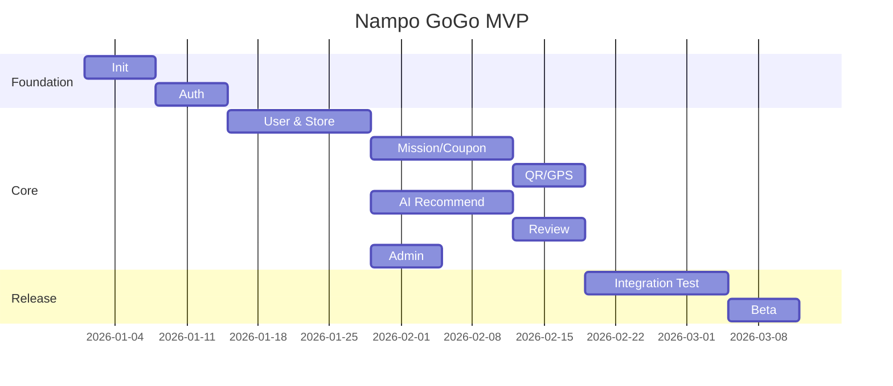

# 29. 개발 일정표 (Gantt)

## 프로젝트 진행률
- 추가 작업: **4 / 5 완료 (80%)**

## 개발 단계

| 단계 | 기간 | 주요 작업 | 선행 |
|---|---|---|---|
| 1 | 1주 | 프로젝트 초기화, CI/CD | - |
| 2 | 1주 | 인증(Auth), 권한 | 1 |
| 3 | 2주 | 사용자/매장 | 2 |
| 4 | 2주 | 미션/쿠폰 | 3 |
| 5 | 1주 | QR/GPS 인증 | 4 |
| 6 | 2주 | AI 추천 | 3 |
| 7 | 1주 | 리뷰/알림 | 4 |
| 8 | 1주 | 관리자 | 3 |
| 9 | 2주 | 통합 테스트 | 5~8 |
| 10 | 1주 | 베타 배포 | 9 |
| 11 | 지속 | 운영/개선 | 10 |

## Mermaid Gantt

## AI 개발 순서
1. DB
2. API
3. Backend
4. Frontend
5. Test
6. Deploy

## 마일스톤
- M1: 인증 완료
- M2: 핵심 기능 완료
- M3: AI 추천 완료
- M4: 베타 오픈
- M5: 정식 출시
